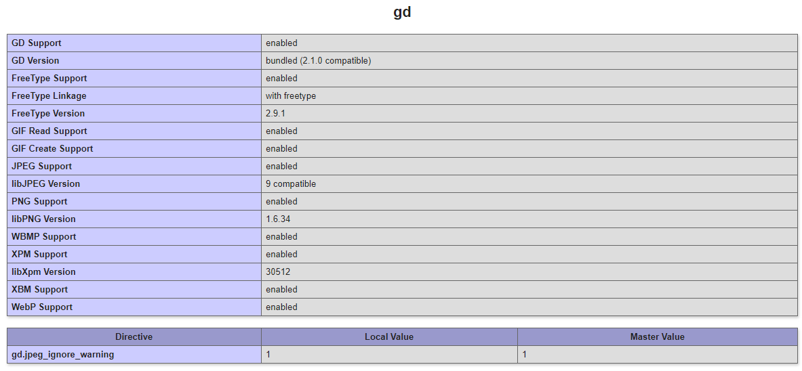

# Практическая Работа с ООП в реализации логики MVC

Практическая работа 24 модуля

## Используемые ресурсы

* Интернет
* Обучающий материал
* Взят шаблон HTML вида и переработан под текущие задачи

### Цели которые были достигнуты

* Разобрана логика MVC в PHP на базовом уровне
* Отработана механика реализации классов в обьектов в реалиях сайта
* Вся поднаготная Шаблона сайта не менялась, работа с Jquery мной не изучалась
* Задание сделано исключительно для моего текущего уровня восприятия PHP
* Отрабатывалось на версии PHP 7.2

### Скрин с подключенным DG:
